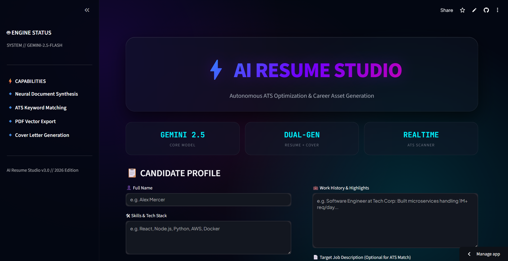
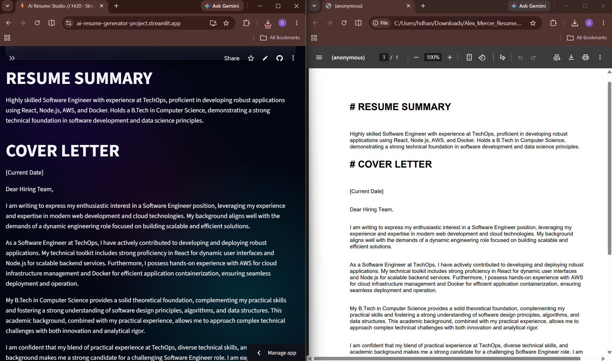
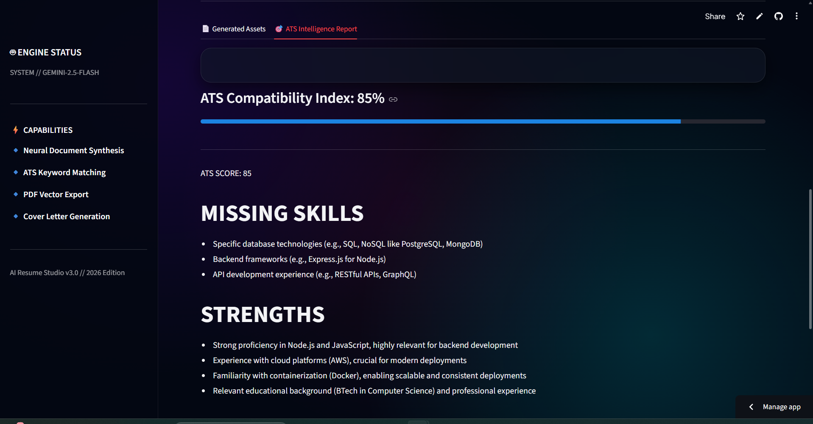

# 🤖 AI Resume Studio

### Generate ATS-Optimized Resumes, Cover Letters & Career Insights with AI

🌐 **Live Demo:** [AI Resume Studio](https://ai-resume-generator-project.streamlit.app/)

---

## 🚀 Overview

AI Resume Studio is a modern AI-powered career assistant built using **Python, Streamlit, and Google Gemini AI**.

The application helps users create professional ATS-friendly resume summaries, generate personalized cover letters, analyze job descriptions, and receive ATS compatibility scores instantly.

Designed with a futuristic animated interface, the platform simplifies the job application process and helps candidates improve their chances of passing Applicant Tracking Systems (ATS).

---

## ✨ Features

### 📄 AI Resume Generator

Generate professional and ATS-friendly resume summaries based on your skills, education, and experience.

### 💌 AI Cover Letter Generator

Create personalized cover letters tailored to your profile and target job role.

### 🎯 ATS Score Analysis

Analyze your profile against a job description and receive an AI-powered ATS compatibility score.

### 📊 Career Insights

Discover:

* Missing Skills
* Key Strengths
* Improvement Suggestions
* ATS Optimization Tips

### 📥 PDF Export

Download generated resumes and cover letters as professional PDF documents.

### 📑 ATS Report Export

Download your ATS analysis and recommendations as a `.txt` report.

### 🎨 Modern UI/UX

Includes:

* Animated Gradient Background
* Glassmorphism Design
* Responsive Layout
* Interactive Metrics
* Futuristic Dark Theme
* Animated Loading Effects
* Celebration Effects

---

## 🛠 Tech Stack

| Technology          | Purpose                              |
| ------------------- | ------------------------------------ |
| Python              | Application Logic                    |
| Streamlit           | Web Application Framework            |
| Google Gemini AI    | AI Content Generation & ATS Analysis |
| ReportLab           | PDF Generation                       |
| Regular Expressions | ATS Score Extraction                 |
| HTML & CSS          | Custom UI/UX                         |

---

## 📂 Project Structure

```text
AI-Resume-Generator/
│
├── app.py
├── pdf_generator.py
├── requirements.txt
├── .gitignore
├── README.md
│
└── screenshots/
    ├── homepage.png
    ├── coverletter_pdf.png
    └── ats_score.png
```

> 🔐 API keys and sensitive configuration files are excluded from the repository using `.gitignore`.

---

## ⚙️ Installation

### Clone Repository

```bash
git clone <repository-url>
cd AI-Resume-Generator
```

### Install Dependencies

```bash
pip install -r requirements.txt
```

### Run Application

```bash
streamlit run app.py
```

---

## 🔑 API Configuration

This project uses the **Google Gemini API** for AI-powered resume generation, cover letter generation, and ATS analysis.

For deployment, configure your API key using Streamlit Secrets:

```toml
GEMINI_API_KEY = "YOUR_GEMINI_API_KEY"
```

⚠️ **Never commit your API key to GitHub.**

---

## 🖥 Application Workflow

1. Enter Candidate Details
2. Add Skills, Education, and Experience
3. Add a Target Job Description (Optional)
4. Generate Resume Summary
5. Generate Cover Letter
6. Analyze ATS Compatibility
7. View ATS Score and Career Insights
8. Download Generated PDF
9. Download ATS Analysis Report

---

## 📸 Screenshots

### 🏠 Home Page



---

### 📄 Resume & Cover Letter Generation



---

### 🎯 ATS Analysis Dashboard



---

## 🌐 Live Demo

Try the deployed application:

👉 **[Launch AI Resume Studio](https://ai-resume-generator-project.streamlit.app/)**

The application is deployed using **Streamlit Community Cloud**.

---

## 🔮 Future Enhancements

* Multiple Resume Templates
* Resume Keyword Optimizer
* LinkedIn Profile Analyzer
* Interview Question Generator
* One-Click Resume Builder
* DOCX Resume Export
* Cloud Storage Integration
* User Authentication
* Resume History
* Job-Specific Resume Optimization

---

## 🎓 Internship Project

Developed as part of the **SystemTron Generative AI Internship Program**.

This project demonstrates the practical use of **Generative AI, Python, Streamlit, and PDF automation** to build an AI-powered career assistance platform.

---

## 👨‍💻 Author

**Dhanush**

Passionate about:

* 🤖 Artificial Intelligence
* 🧠 Machine Learning
* 📊 Data Science
* 💻 Full-Stack Development
* 🚀 AI-Powered Applications

---

## ⭐ Support

If you like this project, consider giving the repository a ⭐ **Star** on GitHub!

Your support is greatly appreciated. 🚀

---

## 📜 License

This project was developed for educational, internship, and portfolio purposes.
